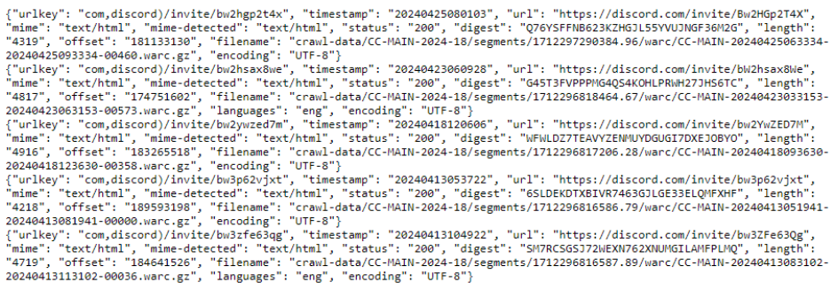
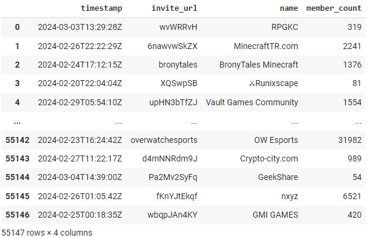
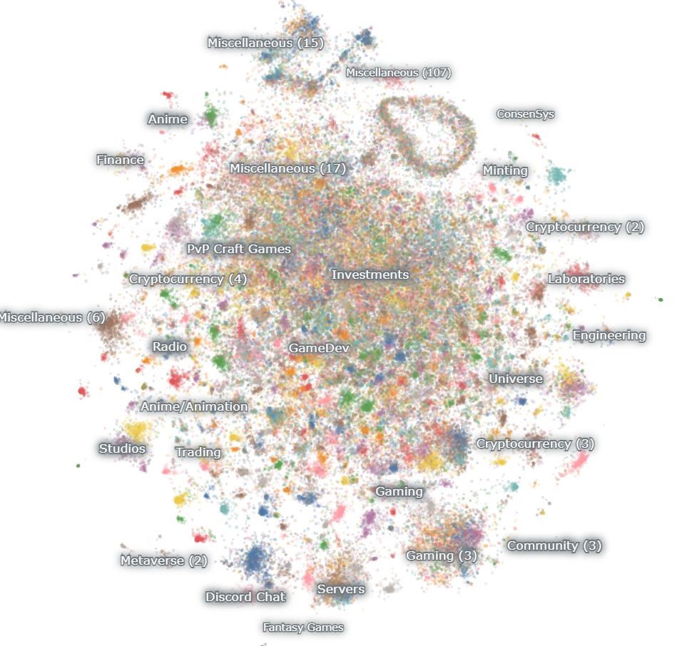

Discord is a platform that lets people create and join “Discord servers”, which are isolated invite-only communities containing collections of chatrooms. Naturally, this makes it not straightforward to access and analyze Discord-related statistics, as you can only see servers you’ve been invited to.

It would be interesting to zoom out and get a broader view of the platform. With a lack of existing detailed exploration on Discord, I decided to make a collection of around 1,000,000 Discord servers in order to find the largest ones, understand the distribution of servers, and categorize and visualize some Discord communities. 

Discord servers are typically found from their invitation links, which are often shared on the web. So, a good way to start would be by finding a lot of invitation links.

## The Common Crawl

The Common Crawl is a large and open repository of web crawl data, and can be used to find Discord invite links. It contains petabytes of HTML from webpages all over the internet, and new crawl data typically gets released every few months. 

There is a
[list of all available crawls](http://index.commoncrawl.org/collinfo.json). The page looks like below:

```json
[
    {
        "id": "CC-MAIN-2024-26",
        "name": "June 2024 Index",
        "timegate": "https://index.commoncrawl.org/CC-MAIN-2024-26/",
        "cdx-api": "https://index.commoncrawl.org/CC-MAIN-2024-26-index",
        "from": "2024-06-12T14:04:24",
        "to": "2024-06-25T23:28:02"
    },
    {
        "id": "CC-MAIN-2024-22",
        "name": "May 2024 Index",
        "timegate": "https://index.commoncrawl.org/CC-MAIN-2024-22/",
        "cdx-api": "https://index.commoncrawl.org/CC-MAIN-2024-22-index",
        "from": "2024-05-17T23:31:22",
        "to": "2024-05-31T00:06:14"
    },
    …
]
```

Each crawl has a name like “CC-MAIN-2024-26” where 2024 is the year and 26 is the week number.

The Common Crawl crawls billions of URLs, but it is possible to choose a crawl and download pages from it that match some URL pattern. This means that by limiting to the pattern of Discord invitation links, it would be possible to find almost* every Discord server whose link was shared on the web and captured by the crawler.

There are three types of discord invitation links:
- discord.com/invite/*
- discordapp.com/invite/*
- discord.gg/*

Before Discord got the .com domain, discord.gg invite links redirected to discordapp.com where the server’s landing page would be shown. Now, the landing page is shown on discord.com and while all forms of invite links still work, they will redirect to the discord.com variation. The discord.gg links are also used commonly. For simplicity, I mainly focused on discord.com invites.

## Downloading from the Common Crawl index

In order to get the crawl data, you have to first get the index data which tells you where the crawl data is. The Common crawl index located at index.commoncrawl.org allows you to know how many matches there are for the url pattern within a crawl and is shown in terms of “pages”. 

For example, the query below looks for all matches of the https://discord.com/invite/* pattern in the 2024-18 crawl:

    https://index.commoncrawl.org/CC-MAIN-2024-18-index?url=https%3A%2F%2Fdiscord.com%2Finvite%2F*&showNumPages=true

It would display a result like

    {'pages': 5, 'pageSize': 5, 'blocks': 23}

Indicating that there are 5 pages of results matching the url pattern.

To actually view the pages, the query can be modified like below:

    https://index.commoncrawl.org/CC-MAIN-2024-18-index?url=https%3A%2F%2Fdiscord.com%2Finvite%2F*&output=json&pageSize=5&page={i}

The result might be quite long, but here’s a small sample of what it would look like:



In each entry, the “filename” indicates which common crawl segment the data for the url can be found in. Additionally, “length” and “offset” indicate the exact byte position in the segment that contains the wanted data. “Digest” is a string that uniquely identifies the data of the crawled url.

By making cURL requests to iterate over each page, the JSON data can be saved to the machine directly. This data can then be loaded and combined into a Python list.

The five pages mentioned above would contain approximately 60,000 to 70,000 URLs in total, potentially leading to the discovery of up to 70,000 Discord servers from the 2024-18 crawl.

The list of invites collected this way may include duplicates. One type is a digest duplicate, where multiple entries reference the same archive data in the Common Crawl. Another type is a duplicate invite link. Both of these types of duplicates are cleaned up before continuing. Additionally, different invite links might point to the same Discord server, but these are retained for now.

## Downloading from the Common Crawl data

In the previous section, only the invite URLs are obtained, without any information about the servers they’re inviting to. This information is available on the server landing page, which typically displays the server name and number of members. Additional details, such as the server icon and server ID, can also be extracted from this page. To gather this information, the HTML data of the crawled URL needs to be downloaded from data.commoncrawl.org.

Common Crawl data is stored in large segment files many GBs in size, with the wanted Discord data mixed within. However, bandwidth can be conserved by retrieving only the necessary parts. This can be achieved using the following cURL command:

    curl -H “range: bytes={offset}-{offset+length-1}” -o {digest} {filename}

In this command, the filename, offset, and length are used to make a cURL request with a byte range, which is supported by the Common Crawl servers. This process can be multithreaded for each entry in the invitation list collected earlier until the HTML data for each entry has been downloaded to the machine. The data is in gz compressed format. A way to verify that all files were downloaded successfully is to use the digest as the name of the file. This allows for checking the existence of all files after downloading. Additionally, the byte lengths of each piece of data can be used to ensure that each saved file is the correct size.

Since there can be tens of thousands of invite links, the above method requires making an equivalent number of requests to the Common Crawl servers. An alternative approach is to establish a persistent HTTP connection to data.commoncrawl.org, which keeps the TCP connection open while downloading all the data, and is more efficient.

No matter which of the above downloading approaches is used, however, the Common Crawl servers have their own limitations and are the main bottleneck of the downloading speed.

## Processing the downloaded HTML

The compressed data can be unzipped, and useful parts extracted from the HTML, specifically the timestamp, invite URL, server name, member count, and server ID. This step also filters out expired Discord invites, which typically account for about 15% to 25% of the collected invite links.

With the wanted information extracted and stored in Python lists, it can then be organized into a single pandas table.



This process was repeated for every crawl newer than 2020, resulting in around 900,000 invites.

## Exploring the data

After setting up a SQLite database and a quick Gradio interface, I could run queries on the table. Interesting results emerged when searching for specific video games, university names, events, and cities. The interface was also effective for finding both popular and obscure servers. Many servers had only one member, the minimum number needed since each server requires an owner. However, identifying whether a server was active or not without joining it remained a challenge, as some servers were old and inactive.

With search queries limited to textual lists of results, I also wanted to visualize the data.

I took roughly the first 110,000 servers and made a map from it using Nomic Atlas.



Each point on the map represents a Discord server, and their placements are based on the text embeddings of the server names. The name of a Discord server often isn’t a good indication of what the server is about, but it kind of works anyway. I detail the map in this video.

I also wanted to observe the progression of Discord server sizes over time, so I retrieved additional invites from the Wayback Machine using a similar method. This brought the total to around 1,180,000 Discord servers, including duplicates. 

Duplicates, occurring at different timestamps, allowed tracking member counts over time. Although the initial goal was to collect invite links dating back to 2015, Discord only started displaying member counts on server landing pages in 2019, limiting the visualizable data to 2019-2024.

After processing, the result was a spreadsheet of member counts over time for all Discord servers that at some point reached the top 10 from 2019 to 2024. This data was animated into a bar chart race using Flourish.studio. The final video is below:

https://www.youtube.com/watch?v=BNbN8532GPM

Key observations from the video:
- Discord used to cap the number of members a server could have, and raised the cap multiple times as top servers grew.
- Gaming communities dominated the top 10 until 2022, when GenAI communities rapidly ascended and now hold the top 3 spots.
- Midjourney is by far the largest discord server.

## Other sources related to Discord

[Explore communities](https://discord.com/servers) -- 
Discord’s own server listing page, which lets people find community servers. It also ranks the top 10 largest Discord servers, but this is not a complete top 10 list as servers must be set as community servers to be discoverable.

[Disboard](https://disboard.org) -- 
A Discord server listing website listing around 1.4 million servers. Servers are listed on Disboard manually by the server’s admins.

[Statista](https://www.statista.com/statistics/1327141/discord-top-servers-worldwide-by-number-of-members/) -- 
Maintains a top 10 bar graph of the largest Discord servers and other related lists, updated every few months.
